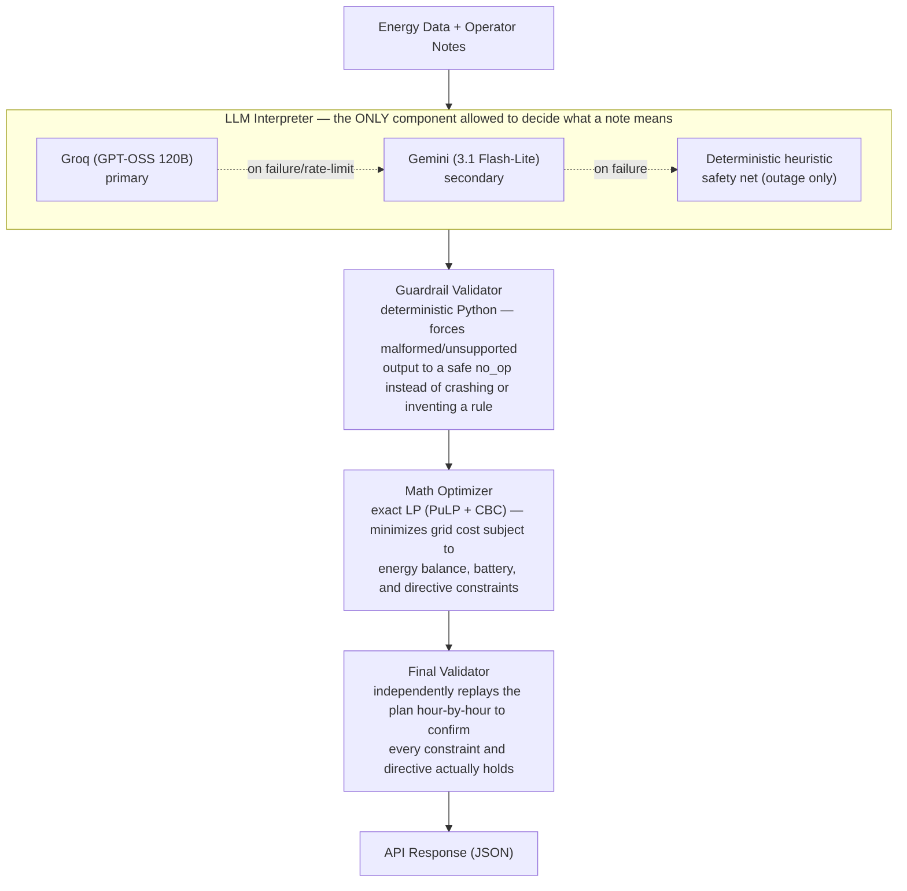

# GridWise Optimizer — BUP CSE Fest 2026 Preliminary

An LLM-assisted 24-hour campus energy scheduling service built for the GridWise preliminary
challenge. It exposes `GET /health` and `POST /optimize-energy`, interprets natural-language
operator notes with a language model, deterministically guardrails that interpretation, and
solves an exact linear program to produce a minimum-cost, constraint-valid 24-hour schedule.

**Live public endpoint:** `https://gridwise-optimizer.onrender.com`
(`GET /health`, `POST /optimize-energy` — no login/VPN required)

## Architecture



- **`app/llm_interpreter.py`** — the mandatory LLM step (Participant Guide Sec. 04). Sends all
  of a scenario's operator notes to the LLM in one call and asks for strict JSON back. Tries
  **Groq first, then Gemini** if Groq fails (rate limit/timeout/outage). This is the only place
  that performs natural-language understanding; nothing downstream re-interprets the notes.
- **`app/guardrails.py`** — treats the LLM's JSON as untrusted. Every entry is checked against
  the exact required shape (directive type, hours, numeric ranges) from the Problem Statement;
  anything that fails is demoted to `no_op` rather than passed through.
- **`app/optimizer.py`** — a linear program (not a heuristic) that minimizes
  `sum(grid_kwh[h] * tariff_bdt_per_kwh[h])` subject to energy balance, battery bounds/rate
  limits, effective solar, and every validated directive, solved exactly with the CBC solver.
- **`app/validator.py`** — replays the returned plan the same way the judge is described as
  doing, so any internal inconsistency is caught before responding.
- **`app/fallback_interpreter.py`** — a small regex/keyword safety net used **only** when the
  LLM call itself fails (timeout, missing key, provider outage, non-JSON response). It is never
  the primary interpreter and tags its entries as `[fallback-heuristic: LLM unavailable]` in
  the response's `explanation` field.

## Environment variables

| Variable | Required | Default | Meaning |
|---|---|---|---|
| `GROQ_API_KEY` | Yes | — | API key for the primary LLM. Free, no card required — get one at [console.groq.com/keys](https://console.groq.com/keys). |
| `GROQ_MODEL` | No | `openai/gpt-oss-120b` | Model id for the primary provider. |
| `GEMINI_API_KEY` | No | — | API key for the secondary LLM, tried only if Groq fails. Free, no card required — get one at [aistudio.google.com/apikey](https://aistudio.google.com/apikey). |
| `GEMINI_MODEL` | No | `gemini-3.1-flash-lite` | Model id for the secondary provider. |
| `GROQ_TIMEOUT_SECONDS` | No | `5` | Timeout budget for the Groq attempt. |
| `GEMINI_TIMEOUT_SECONDS` | No | `15` | Timeout budget for the Gemini attempt, only reached if Groq fails. |
| `PORT` | No | `8000` | Port the HTTP server binds to. |

Copy `.env.example` to `.env` and fill in `GROQ_API_KEY` (and optionally `GEMINI_API_KEY`).
**Never commit `.env`.**

## LLM role & guardrails (summary)

The LLM receives the directive-type spec and every operator note in one call, then returns one
structured interpretation per note as JSON. Its output is validated before optimization:

- `directive_type` must be one of the six supported types, else the entry becomes `no_op`.
- `hours` must be unique ascending integers 0-23.
- `solar_reduction.factor` must be in `[0, 1]` (usable fraction remaining, e.g. an 80%
  reduction → `factor = 0.2`).
- `minimum_battery_reserve.minimum_energy_kwh` and `max_grid_window.max_grid_kwh` must be
  finite and non-negative (reserve additionally capped at battery capacity).
- Exactly one entry per note, covering `note_index` 0..N-1; missing/duplicate entries are
  filled/deduped with `no_op`.
- `no_op` ⇔ `applies=false` and `structured_adjustment=null`; every other directive requires
  `applies=true`.

## Optimizer & solver

- **Library:** [PuLP](https://coin-or.github.io/pulp/) with the bundled CBC solver (open
  source and local to the service).
- **Formulation:** one LP per request — `grid`, `solar_used`, `charge`, `discharge`, and
  `battery_energy` variables for each of the 24 hours, with hard constraints for energy
  balance, battery bounds/rate limits, effective solar (after `solar_reduction`), reserve
  floors (`minimum_battery_reserve`), forced-zero charge/discharge windows, grid caps
  (`max_grid_window`), and end-of-day neutrality. A cycling-regularization term is included.
- **Infeasibility fallback:** if constraints are infeasible, directive groups are progressively
  relaxed (`max_grid_window` → `minimum_battery_reserve` → `no_discharge_window` →
  `no_charge_window` → `solar_reduction`) until a valid schedule exists, and `plan_summary`
  reports the fallback.

## Local quickstart

Requires Python 3.11+. (CBC ships with the `pulp` wheel on Windows/macOS/Linux — no separate
solver install needed for local runs; the Docker image installs the `coinor-cbc` system
package explicitly for portability.)

```powershell
# 1. Clone and enter the repo
git clone <your-repo-url>
cd GridWise-Optimizer

# 2. Create a virtual environment and install dependencies
python -m venv .venv
.\.venv\Scripts\Activate.ps1
pip install -r requirements.txt

# 3. Configure environment variables
copy .env.example .env
# then edit .env and set GROQ_API_KEY

# 4. Run the service
uvicorn app.main:app --host 0.0.0.0 --port 8000
```

(bash/macOS/Linux equivalent: `python3 -m venv .venv && source .venv/bin/activate`, `cp` instead
of `copy`.)

### Test /health

```bash
curl http://localhost:8000/health
# {"status":"ok"}
```

### Test /optimize-energy against a public sample

```bash
curl -X POST http://localhost:8000/optimize-energy \
  -H "Content-Type: application/json" \
  --data-binary @- <<'EOF'
{
  "scenario_id": "GRID-101",
  "operator_notes": [
    "Solar output will drop to about 20% from 1 PM to 3 PM.",
    "Do not charge the battery between 2 PM and 4 PM.",
    "The cafeteria menu changes tomorrow."
  ],
  "hours": [ ... 24 hourly entries, see samples/public_cases.json ... ],
  "battery": {
    "capacity_kwh": 500,
    "initial_energy_kwh": 200,
    "minimum_energy_kwh": 50,
    "max_charge_kwh_per_hour": 100,
    "max_discharge_kwh_per_hour": 100
  }
}
EOF
```

Full worked request/response bodies for all 10 public cases are in
[`samples/public_cases.json`](samples/public_cases.json).

### Tests

The `tests/` folder covers guardrails, the optimizer, and the full API path.
Use the project test commands to run the relevant checks locally.

## Docker fallback image

```bash
# Build
docker build -t gridwise-optimizer:latest .

# Run (no secrets baked into the image — pass the key(s) at runtime)
docker run --rm -p 8000:8000 \
  -e GROQ_API_KEY=your_groq_key_here \
  -e GROQ_MODEL=openai/gpt-oss-120b \
  -e GEMINI_API_KEY=your_gemini_key_here \
  -e GEMINI_MODEL=gemini-3.1-flash-lite \
  gridwise-optimizer:latest

# Verify
curl http://localhost:8000/health
```

The image binds to `0.0.0.0:${PORT}` (default `8000`), matches the documented port, and
contains no baked-in credentials — `GROQ_API_KEY` must be supplied via `-e` or your
platform's secret-injection mechanism at runtime.

Published image:

```
docker pull turzaiftiak/gridwise-optimizer:latest
# digest: sha256:d05ee9cc626bf4c9f6b1d77feb0267a991ae684821137782f03bf6d78f4a1231
```

Verified locally: built with `docker build`, run with `docker run -p 8000:8000`, and
`GET /health` returned `{"status":"ok"}` before pushing.

## Dependencies

- [FastAPI](https://fastapi.tiangolo.com/) + [Uvicorn](https://www.uvicorn.org/) — HTTP service.
- [Pydantic v2](https://docs.pydantic.dev/) — request/response schema validation.
- [Groq API](https://console.groq.com/docs) (OpenAI-compatible, called via `httpx`) — primary LLM.
- [Gemini API](https://ai.google.dev/) (called via `httpx`) — secondary LLM, used only if Groq fails.
- [PuLP](https://coin-or.github.io/pulp/) + CBC — the deterministic LP optimizer/solver.
- [python-dotenv](https://github.com/theskumar/python-dotenv) — loads `.env` locally.

## Known limitations

- The fallback interpreter uses simple keyword and regex matching when both LLM providers fail.
- Overlapping directives are combined using conservative per-hour rules.
- Infeasible directive combinations trigger the documented relaxation fallback.
- API responses do not include secrets or stack traces; detailed errors are logged server-side.
